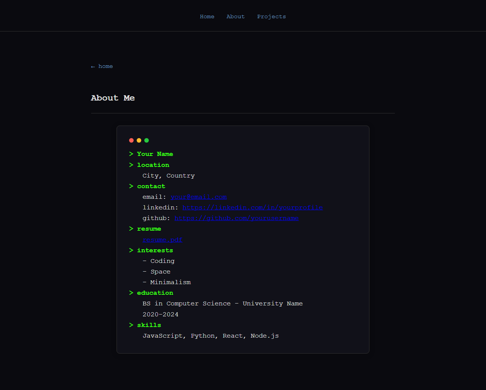
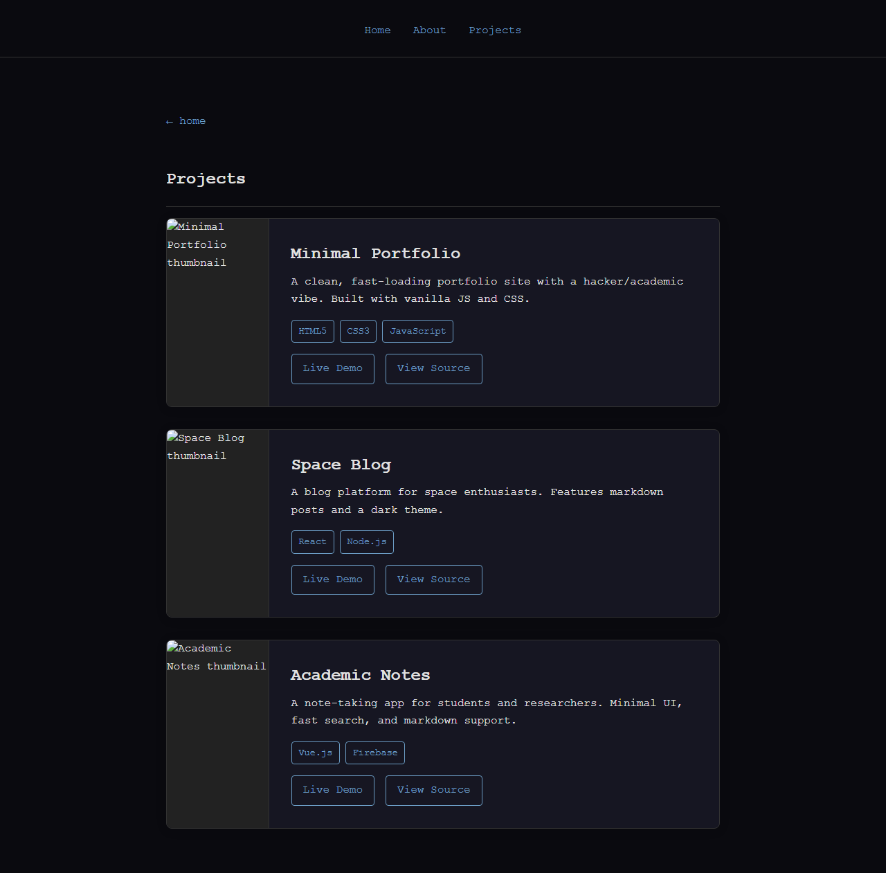

# Personal Website

A minimalist personal website inspired by Jake Gines and Justin Chi. Features a dark/space theme, monospace typography, and clean "hacker/academic" vibe.

## Structure
- Home: Minimal hero, intro, navigation
- About: Terminal UI, personal info
- Projects: Project cards, tech tags

## Tech
- HTML5, CSS3, Vanilla JS
- Static hosting (GitHub Pages, Netlify, Vercel)

## Setup
Open index.html in your browser or deploy to a static host.

## Customization
Edit `js/data.js` for your info and projects.

## Pages Snapshot

Below are quick snapshots (textual + links) of the current pages on this branch. Each page's image snapshot is embedded directly under its description.

- Branch name: `001-Plan.md-by-ChatGPT5.2-implement-by-GPT4.1`

  - Home: [index.html](index.html)
    - Snapshot: large centered hero with name/title, short tagline, navigation links to About / Projects. Minimal, Jake-style spacing and monospace heading.

    - Home snapshot:

      

  - About: [about.html](about.html)
    - Snapshot: Jake-style page wrapper containing a Justin-inspired terminal block: mock macOS header dots, a prompt line (`> {name}`) with blinking cursor, command-like lines for location, contact, resume, interests, education, and skills.

    - About snapshot:

      

  - Projects: [projects.html](projects.html)
    - Snapshot: Vertical list of project cards. Each card is a thin-outlined rectangle with a left image area (20% width) and a right content area (80% width) containing title, 2–5 line description, and rectangular tech tags below.

    - Projects snapshot:

      

## Branch Summary

- Branch name: `001-Plan.md-by-ChatGPT5.2-implement-by-GPT4.1`
- Purpose: Implement the project plan and scaffold the site structure described in `plan.md` and `prompt.md`.
- Key files added/changed on this branch:
  - `plan.md` — full implementation plan + commit log
  - `prompt.md` — initial ChatGPT 5.2 prompt (user-provided) and commit log
  - `index.html`, `about.html`, `projects.html` — scaffolded pages following Jake-style wrapper and Justin-inspired content layouts
  - `css/main.css`, `css/about.css`, `css/projects.css` — styles for global layout, terminal block, and project cards (20% image / 80% content)
  - `js/data.js`, `js/terminal.js`, `js/projects.js` — data-driven content model and minimal interactive behavior (cursor blink, dynamic project rendering)
  - `README.md` — this file (updated with snapshots and branch summary)

- Commit notes summary:
  - Created a detailed implementation plan and added it to `plan.md` (committed).
  - Updated `prompt.md` with the user's Chinese initial prompt and commit log (committed).
  - Scaffolded the site (HTML/CSS/JS) and committed the files; later removed the `Reference-Website-Snapshot` folder and amended the commit to exclude large snapshot images.

## Next steps you can ask me to do

- Regenerate screenshots at different viewport sizes or image formats.
- Tweak the `about.html` terminal content to match your exact text (edit `js/data.js`).
- Add project entries to `js/data.js` and provide thumbnails under `assets/images/`.
- Push the branch to remote (I can run `git push` if you want).

