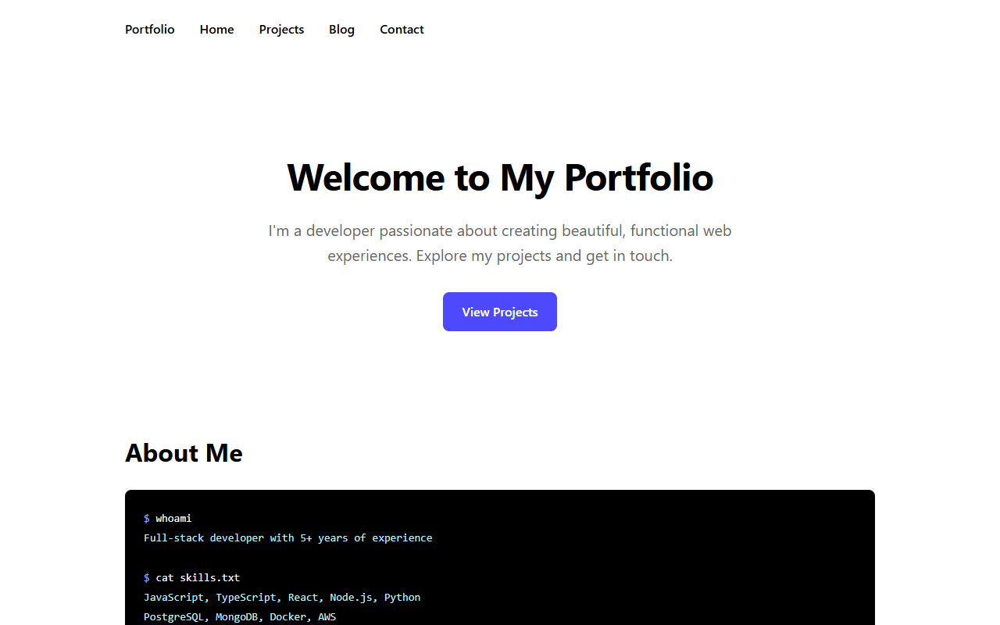
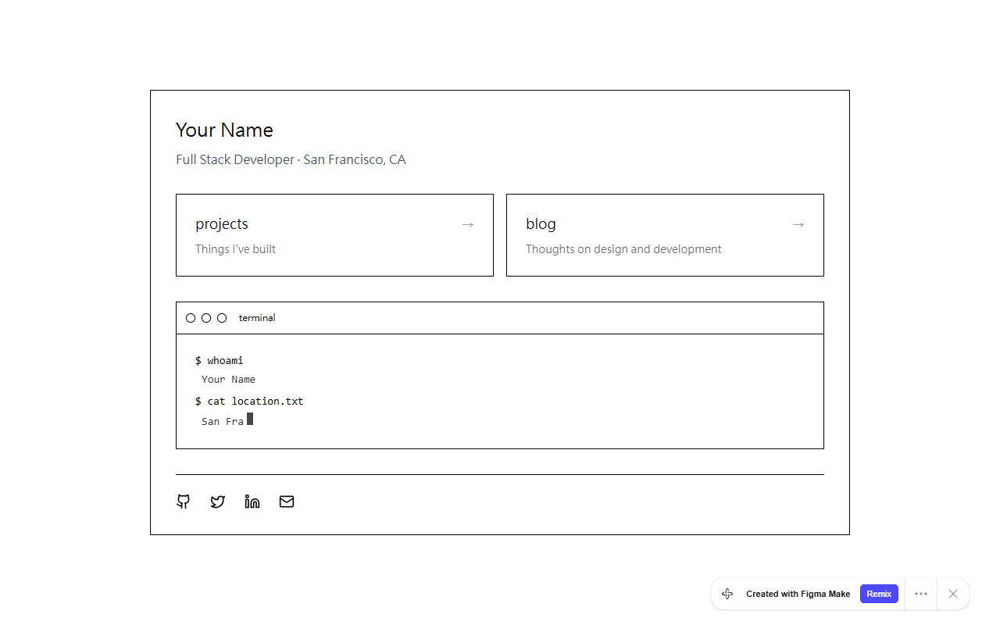

# 個人作品集網站 — Figma 設計複製

**語言 / Language**: [English](README.md) | 繁體中文

以 [Figma 參考設計](https://ice-turn-79703411.figma.site/) 為基礎，手工複製打造的靜態個人作品集網站。包含終端機風格首頁、專案頁、部落格頁，以及深色/淺色主題切換。採用 [Speckit](https://github.com/microsoft/github-copilot-specs) 規格驅動開發流程。

---

## 網站預覽

### 實作成果



### Figma 參考設計



---

## 功能特色

- ✅ 終端機風格首頁（`$ whoami`、`$ cat`、`$ ls skills/` 等命令區塊）
- ✅ 首頁導航連結至專案頁與部落格頁
- ✅ 社群媒體連結（GitHub、LinkedIn、Email）
- ✅ 專案頁：6 張專案卡片（標題、年份、描述、技術標籤）
- ✅ 滑鼠懸停效果與 Figma 參考一致
- ✅ 部落格頁：3 篇文章卡片
- ✅ CSS 變數驅動的深色 / 淺色主題切換
- ✅ 鍵盤操作與螢幕閱讀器友善（無障礙 a11y）
- ✅ 使用 SSIM 演算法的視覺回歸測試（Python + Puppeteer）

---

## 專案結構

```
My-Personal-Website/
├── frontend/
│   └── src/
│       ├── index.html           # 首頁
│       ├── main.js              # 主要 JavaScript
│       ├── components/          # 可重用 JS 元件
│       │   ├── BlogCard.js
│       │   ├── ProjectCard.js
│       │   ├── TerminalBlock.js
│       │   └── ThemeToggle.js
│       ├── data/
│       │   ├── projects.json    # 6 個專案資料
│       │   └── posts.json       # 3 篇部落格文章
│       ├── pages/
│       │   ├── projects.html
│       │   └── blog.html
│       └── styles/
│           ├── main.css
│           ├── theme.css        # CSS 變數（深色/淺色）
│           ├── projects.css
│           ├── terminal.css
│           └── a11y.css
├── specs/
│   └── 005-figma-site-clone/    # Speckit 生成的設計文件
│       ├── spec.md              # 功能規格
│       ├── plan.md              # 實作計畫
│       ├── tasks.md             # 分階段任務清單
│       ├── research.md          # 參考網站分析
│       ├── data-model.md        # JSON 資料模型
│       ├── quickstart.md        # 開發環境快速設定
│       └── contracts/
│           └── openapi.yaml
├── tests/
│   └── visual/                  # 視覺回歸測試
│       ├── capture.js           # Puppeteer 截圖腳本
│       ├── compare_ssim.py
│       ├── test_homepage_ssim.py
│       └── test_project_alpha_ssim.py
├── figma-site-snapshots/        # Figma 參考截圖
└── package.json
```

---

## 快速開始

### 前置需求

- Node.js 16 以上
- 靜態檔案伺服器（例如 VS Code 的 [Live Server](https://marketplace.visualstudio.com/items?itemName=ritwickdey.LiveServer) 或 `npx serve`）

### 本地執行

```bash
# 克隆專案
git clone https://github.com/alex-wy-hsu/My-Personal-Website.git
cd My-Personal-Website

# 啟動前端伺服器
npx serve frontend/src
# 或直接以瀏覽器開啟 frontend/src/index.html
```

### 執行視覺測試

```bash
# 安裝相依套件
npm install

# 擷取截圖（需先在 port 3000 啟動開發伺服器）
node tests/visual/capture.js

# 執行 SSIM 比對
python tests/visual/test_homepage_ssim.py
python tests/visual/test_project_alpha_ssim.py
```

---

## 規格與設計文件（Speckit）

本功能使用 [Speckit](https://github.com/microsoft/github-copilot-specs) 進行規格驅動的 AI 輔助開發。

| 文件 | 說明 |
|---|---|
| [spec.md](specs/005-figma-site-clone/spec.md) | 功能規格與使用情境 |
| [plan.md](specs/005-figma-site-clone/plan.md) | 技術實作計畫 |
| [tasks.md](specs/005-figma-site-clone/tasks.md) | 分階段任務清單 |
| [research.md](specs/005-figma-site-clone/research.md) | 參考網站分析 |
| [data-model.md](specs/005-figma-site-clone/data-model.md) | JSON 資料結構說明 |
| [quickstart.md](specs/005-figma-site-clone/quickstart.md) | 開發環境快速設定指南 |

---

## 技術棧

| 層級 | 技術 |
|---|---|
| 標記語言 | HTML5 |
| 樣式 | CSS3（自訂屬性，無框架） |
| 邏輯 | Vanilla JavaScript（ES2020） |
| 截圖工具 | Puppeteer（Node.js） |
| 視覺測試 | Python + scikit-image（SSIM） |
| 開發流程 | Speckit + GitHub Copilot |

---

## AI 開發資訊

### 開發流程

本專案採用 **規格驅動 AI 工作流程**：

1. `/speckit.specify` — 從自然語言描述生成 `spec.md`
2. `/speckit.plan` — 產出 `plan.md`、`research.md`、`data-model.md` 與 `quickstart.md`
3. `/speckit.tasks` — 將實作工作拆解為分階段任務（`tasks.md`）
4. `/speckit.implement` — 由 GitHub Copilot Agent 執行任務

### 使用的 AI 工具

- **GitHub Copilot**（Agent 模式）— 程式碼實作
- **Speckit 指令** — 規格、計畫與任務生成
- **參考網站**：[ice-turn-79703411.figma.site](https://ice-turn-79703411.figma.site/)

---

## 授權

本專案僅供學習與個人作品集展示使用。
